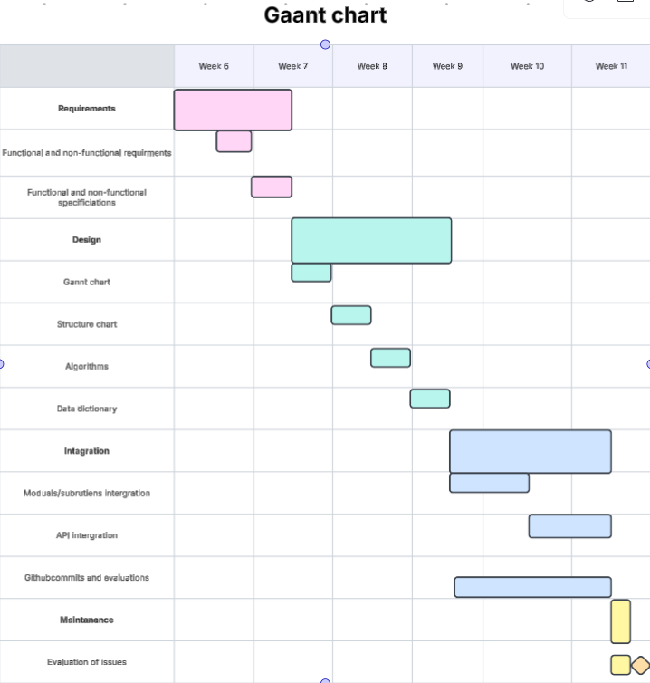
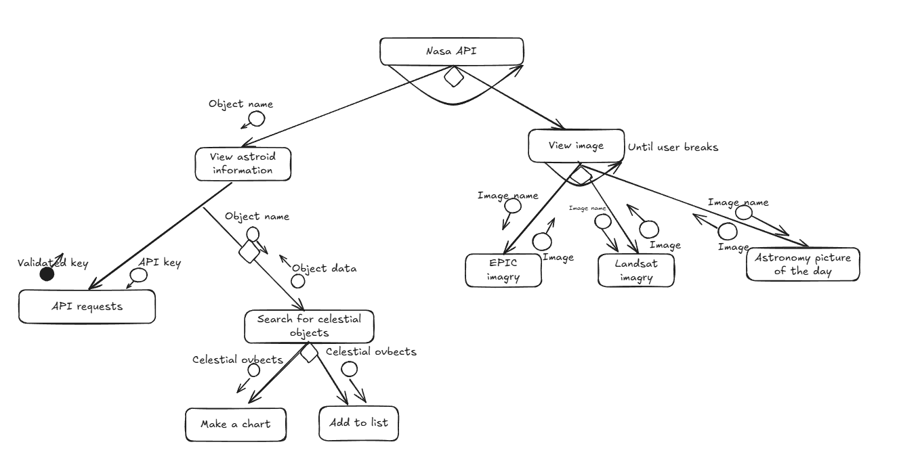
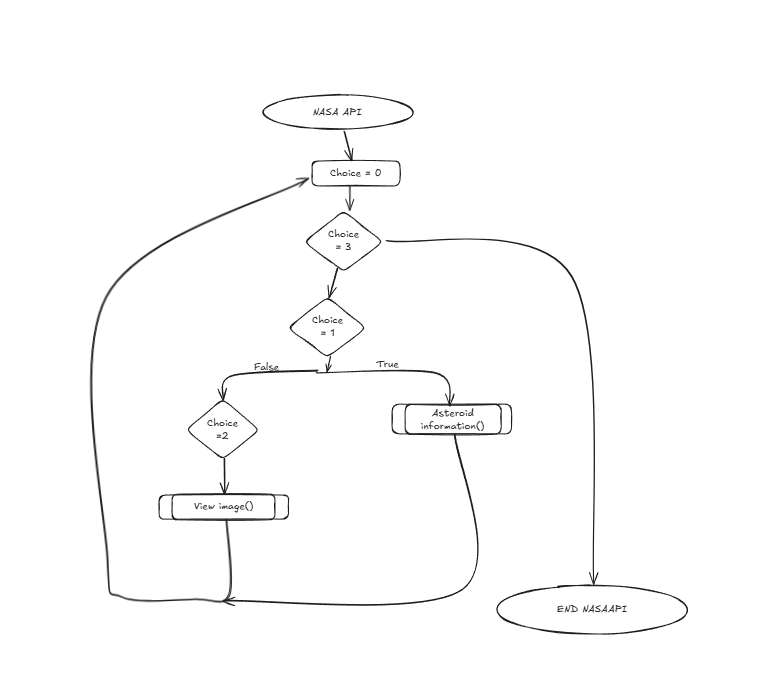
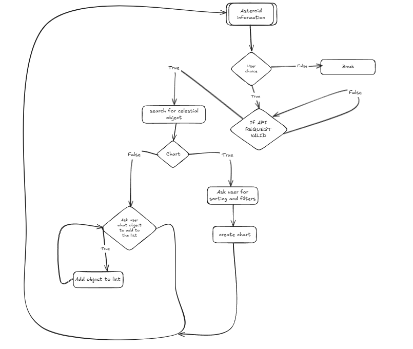
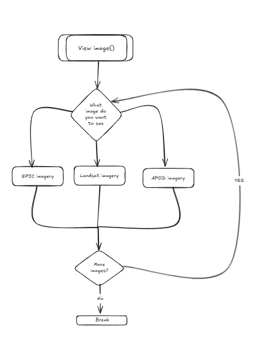
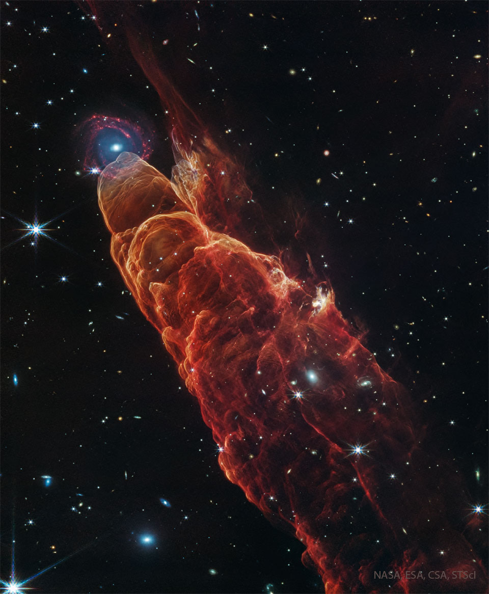
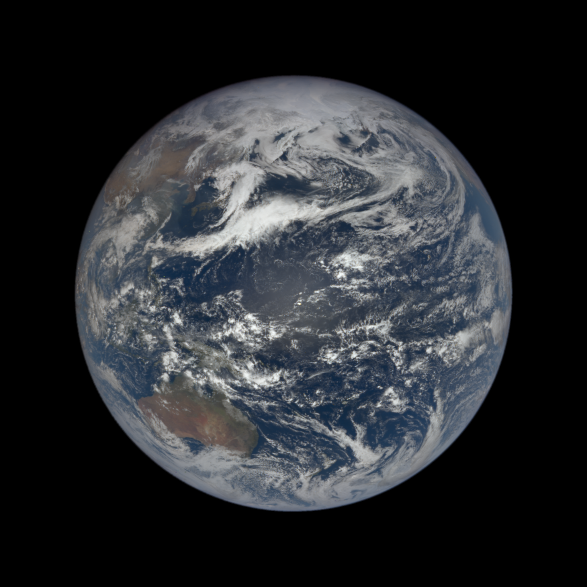

# DATA SCIENCE PROJECT
---
## Requirements
### Functional Requirements
* Data retrival
    * The user should be able to view and oberve them.
* User interface
    * The UI should let the user interact with the API easily and reliably
* Data Display
    * The user should be able to display pictures graphs and tables for the user to compare and see.

---
### Non-Functional-Requirements
* Performance
    * The system should be able to run on any computer made after 2010 that has access to the internet
* Reliability
    * The system should run everytime as long as the user has a valid API key
* Usability and Accessibility
    * Anyone with basic reading and computer skills should be  able to use the program
---
## Determining Specifications
### Functional Specifications
* User Requirements
    * The user should be able to:
    1. Recieve raw data such as NeoWs from the NASA API
    2. Make modifications such as filtering or sorting and adding to lists
    3. Get astronomy pictures of the day from the API
    4. Get the Landsat and EPIC imagry from the API
their information
* Inputs and outputs
    * The user should be able to ask for data and the system should be able to present the data to the user.
* Core Features
    * The program should be able to recieve data from the NASA API and present it to the user with a UI
* User Interaction
    * The user interacts with the system through a Graphical User Interface and it should display pictures, videos, tables and text
* Error Handling
    * Errors such as the user requesting data that doesnt exsits or the user having too many requests to the API and the key running out
### Non Functional Specificications
* Performance
    * The program should be able to complete tasks at the speed of the internet of the user.
* Useability / Accessibility
    * The user interface will be easy to understand to ensure all people can use it. The API key will be preplaced in the system so that people with less knowledge of the internet and computers can use it
* Reliability
    * The system will show an error to the user instead of the system so the system wont crash. All wrong inputs will be ignored.
---
## Use cases
* Actors
    * Astronomers and people with an astronomy hobby.
* Preconditions
    * Internet access and API access
* Main Flow
    1. Ask what the user wants - (image or data)
    2. Show the user an image or dataset
        * If user selects dataset, user edits the dataset
        * Displays edited dataset.
        * and or, create a graph for the user
        * If user selects image, Show the image and information relating to the image.
        * Ask if the user wants to compare images
        * Show two images side by side for the user to compare
        * Make a list of celstial objects and view their information
    3. Go back to the begining
* Postconditions
    * New table, graph and dataset is stored or removed. Images are retrieved, stored, compared or removed.
---
## Design
#### Gantt Chart :

#### Structure Chart : 

#### Algorithms :
    BEGIN NASAAPI()
        choice = 0
        WHILE choice = 1
            astroidinformation()
        WHILE choice = 2
            compareimages()
    astroidinformation()
        IF API Request Valid THAN
                CONTINUE
        User choice = 0
    
        search for celestial objects()
            User choice = 0
            IF user choice is 1 THAN
                make a chart:
                    ASK filters, conditions and ordering
            ELSE add object to list
                ASK object
    compareimages()
        IF API Request Valid THAN
                CONTINUE
        ASK what imagery does the user want to see EPIC LANDSAT OR APOD
        RETURN image
        

#### Data Dictionary :
|Variable        |Data Type      |Format for Display|Size in Bytes|Size for Display|Description                           |Example     |Validation                                                           | | |
|----------------|---------------|------------------|-------------|----------------|--------------------------------------|------------|---------------------------------------------------------------------|------|-------|
|APOD            |JPG or Txt file| Image or text    |1000000      |1080/504 pixels |Astronamy picture of the day          | |Must be a JPG image or a text file containing the link to a  YT video|      |       |
|Apod information|Json           |Text              |3072         |N/A             |Information about the APOD            |    "explanation": "What's at the tip of this interstellar jet?  First let's consider the jet: it is being expelled by a star system just forming and is cataloged as Herbig-Haro 49 (HH 49).  The star system expelling this jet is not visible -- it is off to the lower right.  The complex conical structure featured in this infrared image by the James Webb Space Telescope also includes another jet cataloged as HH 50.  The fast jet particles impact the surrounding interstellar gas and form shock waves that glow prominently in infrared light -- shown here as reddish-brown ridges.  This JWST image also resolved the mystery of the unusual object at HH 49's tip: it is a spiral galaxy far in the distance.  The blue center is therefore not one star but many, and the surrounding circular rings are actually spiral arms.   Jump Around the Universe: Random APOD Generator",    |Json written out as text                                             |      |       |
|Landsat         |PNG            |Image             |1200000      |2048/2048 pixels|Satalite images of the earth          |      |Must be a PNG image                                                  |      |       |
|Landsat coords  |Float          |float             |64           |N/A             |Coordinates of the landsat image taken|  1233.12333, -123.23444 |Must be two floats                                                   |      |       |
|EPIC            |PNG            |image             |2800000      |2048/2048 pixels|Satalite images of the earth          |               |Must be a PNG image                                                  |      |       |
|Neows           |json           |text              |3072         |N/A             |Information about astroids            |DBU_DR2.json|Must be a json file                                                  |      |       |

## Maintanance:

1. Explain how you would handle issues caused by changes to the NASA API over time.
 * I would revisit the new parameters that nasa has added and fix the error while documenting the process.
2. Explain how you would ensure the program remains compatible with new versions of Python and libraries like requests and matplotlib.
 * The user needs to make sure their version of python is updated and so is all of the libraries listed in requirements.txt
3. Describe the steps you would take to fix a bug found in the program after deployment.
 * To fix the bug I would first make sure the users python version and libraries are downloded and updated. I would then look through the code myself and take basic debugging procedures while documenting the process.
4. Outline how you would maintain clear documentation and ensure the program remains easy to update in the future.
 * I would, document all progress and add comments to code to make it easier to understand for future updates and use.

## Final Evaluation:
1. Evaluate the current functionality of the program in terms of how well it addresses the functional and non-functional requirements.
* My project hit most of my functionality and non-functionality requirments. My goal to make the Neows display a table was not successfull but it still displays the main points in the forms of a json file. The UI effectivally and efficiently lets the user interact with the program and get all information. The program lets the user access data from the NASA API and gives it to the user in a readable manner. The program has done its task in terms of the functional requirments. In terms of non functional requirments my program has hit all of the parameters from performance to reliability and usability/accessibility.
2. Discuss areas for improvement or new features that could be added.
* My program while effective has many area for improvment such as the fact that it cannot download any APODS in a video format. It also displays NEOWS information in a very complicated way that is hard for the average user to understand. Fixing this can include putting NEOWS information in a CSV file or a graph. Making the EPIC file less complicated is also one of the first things I would do to ensure it is easier to understand and edit in the future. I would Make the APOD information easier to understand and formatted more neatly so the user has an easier time understanding it making the program more availavble to a larger audiance. I would also make the landsat more reliable possibly by migrating it to a google earth API instead which has pictures from hundreds of different sattalites rather than one, fixing the issue with the blank spots.
3. Evaluate how the project was managed throughout its development and maintenance, including your time management and how challenges were addressed during the software development lifecycle.
* My projects sustained mulitple different shifts in development. My time management was not the best but it was effective enougth to succeed in making a working code that runs without errors. The waterfall format helped me manage the time and get an idea of the size of the project. Through working on it one function at a time it was easy to test the system with unit testing, intergration testing and system testing. I faced many challenges such as the fact that you cant work on NASA API's at school because it is blocked by the internet. Due to this I was forced to do the testing and debugging at home, I overcame this from working on the code at school and getting tips from stackoverflow and my dad that does software.