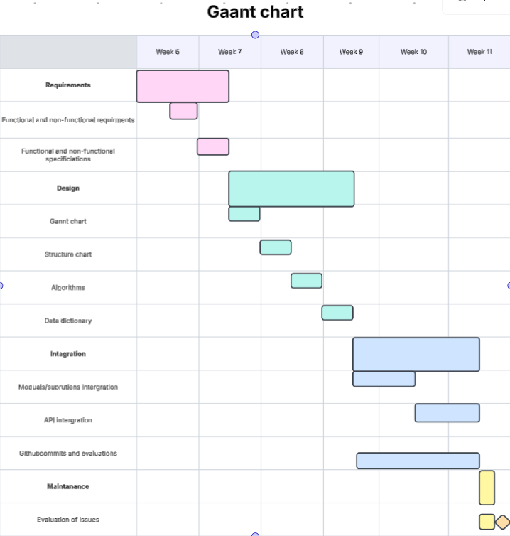

# DATA SCIENCE PROJECT
---
## Requirements
### Functional Requirements
* Data retrival
    * The user should be able to view and oberve them.
* User interface
    * The UI should let the user interact with the API easily and reliably
* Data Display
    * The user should be able to display pictures graphs and tables for the user to compare and see.

---
### Non-Functional-Requirements
* Performance
    * The system should be able to run on any computer made after 2010 that has access to the internet
* Reliability
    * The system should run everytime as long as the user has a valid API key
* Usability and Accessibility
    * Anyone with basic reading and computer skills should be  able to use the program
---
## Determining Specifications
### Functional Specifications
* User Requirements
    * The user should be able to:
    1. Recieve raw data such as NeoWs from the NASA API
    2. Make modifications such as filtering or sorting
    3. Get astronomy pictures of the day from the API
    4. Get the Landsat and EPIC imagry from the API
* Inputs and outputs
    * The user should be able to ask for data and the system should be able to present the data to the user.
* Core Features
    * The program should be able to recieve data from the NASA API and present it to the user with a UI
* User Interaction
    * The user interacts with the system through a Graphical User Interface and it should display pictures, videos, tables and text
* Error Handling
    * Errors such as the user requesting data that doesnt exsits or the user having too many requests to the API and the key running out
### Non Functional Specificications
* Performance
    * The program should be able to complete tasks at the speed of the internet of the user.
* Useability / Accessibility
    * The user interface will be easy to understand to ensure all people can use it. The API key will be preplaced in the system so that people with less knowledge of the internet and computers can use it
* Reliability
    * The system will show an error to the user instead of the system so the system wont crash. All wrong inputs will be ignored.
---
## Use cases
* Actors
    * Astronomers and people with an astronomy hobby.
* Preconditions
    * Internet access and API access
* Main Flow
    1. Ask what the user wants - (image or dataset)
    2. Show the user an image or dataset
        * If user selects dataset, user edits the dataset
        * Displays edited dataset.
        * and or, create a graph for the user
        * If user selects image, Show the image and information relating to the image.
        * Ask if the user wants to compare images
        * Show two images side by side for the user to compare
    3. Go back to the begining
* Postconditions
    * New table, graph and dataset is stored or removed. Images are retrieved, stored, compared or removed.
---
## Design
#### Gantt Chart :

#### Structure Chart : 
#### Algorithms :
#### Data Dictionary :